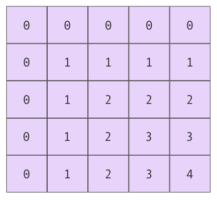
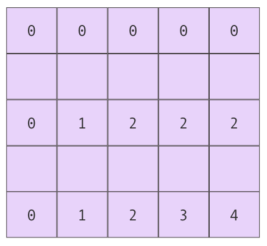

<!-- Run this slideshow via the following command: -->
<!-- reveal-md README.md -w -->


<!-- .slide: class="header" -->
# Collection types & Control Flow

## [Slides](https://make-school-courses.github.io/MOB-1.1-Introduction-to-Swift/Slides/03-Arrays-Loops-Dictionaries/README.html ':ignore')

<!-- > -->

## Agenda

- Learning Objectives
- Collection Types
- Activity on Arrays & Dictionaries
- Break
- Control Flow
- Activity on Control Flow
- Wrap Up

<!-- > -->

## Learning Objectives

By the end of this lesson, students should be able to:

- Construct and use Arrays to store collections of data
- Declare and use Arrays and Dictionaries
- Differentiate & use the various types of loops in Swift
- Apply Optionals in creating and using different collection types

<!-- > -->

## Arrays

The most common collection type in Swift. Collections are containers that let us store multiple values together.

Arrays are typed and they store multiple values in a list.

<!-- v -->

An **ordered** collection of values **of the same type**

Arrays are **zero-indexed**.


<aside class="notes">
Zero-indexed means the index of the first element is always 0, the second is 1, third is 2 and so on.

The last element has an index equal to the number of values in the array minus one.

In the example above, there are 4 elements of type String. Their indices go from 0 to 3.
</aside>

<!-- v -->

### Creating an array

Using an **array literal**

```swift
let concentrations = ["MOB", "BEW", "FEW", "DS"]
```

The type is `[Int]`

<aside class="notes">
An array literal is a list of values separated by commas, inside square brackets.

The type inside the square brackets tell us the type of values the array can store.
</aside>

<!-- v -->

### Creating an empty array

`let concentrations = []`

```swift
Empty collection literal requires an explicit type
```

If we need an empty array, we need to specify it's type since Xcode can't infer it.

Here's two ways to do it.

`var concentrations : [String] = []`

`var concentrations = [String]()`

<!-- v -->

## Appending elements

We can add elements to an array using different methods:

```swift
concentrations.append("ROB")
concentrations += ["ROB"]
concentrations.insert("ROB", at: 2)
```
<aside class="notes">
The append method will add the new element at the end of the array.

+= operator will also add it at the end.

The insert method lets us define the position in the array where we want the new element.
</aside>

<!-- v -->

## Removing elements

There are several alternatives to remove elements.

```swift
concentrations.removeLast()
concentrations.remove(at:4)
```

<aside class="notes">
Both methods will do two things, they will remove the element while also returning it in case you need to store it and use it.
</aside>

<!-- v -->

## Updating elements

There are several alternatives to remove elements.

```swift
concentrations[0] = "MOBILE"
```

<aside class="notes">
Here we use the subscript syntax to update the content.

Important: Be sure to NOT use an index that goes beyond the bounds of the array. Or else the program will crash.
</aside>

<!-- v -->

## Swapping

```swift
concentrations.swap(1,2)
```

<aside class="notes">
The swap method lets us exchange the position of two elements.
</aside>

<!-- v -->

## Sorting

```swift
concentrations.sort()
concentrations.sorted()
```
<aside class="notes">
The sort method will order the elements in the array.

The sorted method will return a sorted copy of the array.
</aside>

<!-- > -->

## In Class Activity

- [Repl.it for Arrays](https://repl.it/classroom/invite/YcJWOag)

<!-- > -->

## Dictionaries

An **unordered** collection of **pairs**.

Each pair has a **key** and a **value**.


<aside class="notes">
Keys are unique.

The same key can't appear more than once in a dictionary.

All keys have to be of the same type and all values have to be of the same type.

Dictionaries are useful when when want to look up values given an identifier. Just like looking up words in a dictionary.
</aside>

<!-- v -->

## Creating a dictionary

Using a **dictionary literal**.

```swift
var coursesAndStudents = ["MOB":30, "BEW":40, "FEW":30, "DS":40]
```

The type is `[String:Int]`

<aside class="notes">
A list of key-value pairs separated by commas inside square brackets.
</aside>

<!-- v -->

## Creating an empty dictionary

```swift
var coursesAndStudents : [String:Int] = [:]
```

<!-- v -->

## Accessing values in a dictionary

We can use subscripting just like in arrays. But since elements are not ordered, instead of looking for an index, we look for a key.

```swift
print(coursesAndStudents["FEW"]!)
```

Why are we using force unwrapping?

<aside class="notes">
The return type is an optional. Meaning the dictionary will first check if there is a value with the key provided. If there is it will return the value, nil otherwise.
</aside>

<!-- > -->

## Adding and Updating to a dictionary

```swift
coursesAndStudents.updateValue(15, forKey: "ROB")
coursesAndStudents["ROB"] = 15
```

<aside class="notes">
These both serve as a way to add a new pair and also to update an existing pair. The code will update the value for the key given or create a new pair if it can't find it.
</aside>

<!-- v -->

## Warming up

```swift
var coursesAndStudents = ["MOB":30, "BEW":40, "FEW":30, "DS":40]
```

Write a function that prints how many students belong to a given track.

<!-- v -->

## Removing elements

```swift
coursesAndStudents.removeValue(forKey:"ROB")
coursesAndStudents["ROB"] = nil
```

<aside class="notes">
These will remove the key and the corresponding value from the dictionary.

There is a difference between the two methods. Assigning a key to nil will remove the value and the key entirely. If we wanted to keep the key and set the value to nil (in case we are dealing with optionals) we should use the removeValue method.
</aside>

<!-- > -->

## Sets

An **unordered** collection of **unique** values of the same type.

```swift
let plantCollection: Set<String> = ["Pothos", "Monstera", "Calathea"]
let plantCollection = Set(["Pothos", "Monstera", "Calathea"])
```

<aside class="notes">
The first option uses a type annotation while the second one let's the compiler infer the type.
</aside>

<!-- v -->

```swift
let plantCollection: Set<String> = ["Pothos", "Monstera", "Calathea", "Pothos"]

print(uniquePlants)
```

What will be the result in the console?

<aside class="notes">
The result will be an unordered list and it will also show unique values. So even if we added the same plant twice, the set will make sure all the elements are unique.
</aside>

<!-- v -->

## Finding elements in a Set

```swift
print(plantCollection.contains("Monstera"))
```

<!-- v -->

## Adding and removing elements

```swift
plantCollection.insert("Ficus")

let removedPlant = plantCollection.remove("Calathea")
```

<!-- > -->

## In Class Activity

Individually answer:

- How are Dictionaries and Arrays different?
- When would you use a Dictionary vs an Array? Are there advantages/disadvantages when using each?
- When would you use a Set vs an Array? Are there advantages/disadvantages when using each?
- When should we use a type annotation vs type inference?

<!-- v -->

Discuss your answers with a neighbor.

- Do you share the same answers?
- Any disagreements?
- A question you both have for the instructor? Raise your hand to get help.

<!-- > -->

<!-- .slide: data-background="#087CB8" -->
## [**10m**] BREAK

<!-- > -->

## Loops

<!-- > -->

## while loop

```swift
while <CONDITION> {
  // code that will loop
}
```

The loop checks the condition for every iteration. When the condition is false, it will stop.

<!-- > -->

## repeat-while loops

```swift
repeat {
  // code that will loop
} while <CONDITION>
```

The condition is evaluated at the end of the loop.

<!-- v -->

```swift
var result = 0

while result < 5{
  result = result + (result + 1)
}
```

```swift
var result = 0

repeat{
  result = result + (result + 1)
} while result < 10
```

<aside class="notes">
What will be the result in each loop?
</aside

<!-- v -->

```swift
var result = 0

while true{
  result = result + (result + 1)
  if result >= 10{
    break
  }
}
```

We can end the loop using the `break` statement. It will stop the execution of the loop and continue with the code after the loop.

<!-- > -->

## Countable ranges

`let closedRange = 0...8`

Goes from 0 to 8 inclusive.


`let halfOpenRange = 0..<8`

Goes from 0 up to, but not including 8.

<!-- > -->

## For loop

```swift
for <CONSTANT> in <RANGE> {
  // code that will loop
}
```

```swift
let count = 5
var result = 0
for i in 1...count{
  result += i
}
```
<aside class= "notes">
The for loop iterates from 1 tp 5, and each time it will update the value of result.

When working with loops that update the value of a variable it is useful to do a whiteboard test and check what is its value in each iteration.

Its important to notice that the constant i is only visible inside the scope of the for loop.
</aside>

<!-- v -->

Sometimes we don't weed the loop constant, we just want to run a block of code certain number of times.

```swift
for _ in 0..count{
  // code that will loop
}
```

<!-- v -->

```swift
var result = 0
for i in 1...10 where i % 2 == 1 {
  result += i
}
````

This for loop has a where clause. It will loop through all of the values in the range but will only execute the block then the where condition is true.

<!-- > -->

## Warming up

```swift
var coursesAndStudents = [("MOB", 30), ("BEW", 40), ("FEW", 30), ("DS", 40)]
```

Write a function that prints how many students belong to each track.

Output:

```swift
There are 30 students in the MOB track
There are 40 students in the BEW track
There are 30 students in the FEW track
There are 40 students in the DS track
```

<!-- > -->

## Challenges



<!-- v -->



<!--
```swift
var sum = 0

for row in 0..<5 {
  if row % 2 != 0 {
    continue
  }

  for column in 0..<5 {
    sum += row * column
  }
}

print(sum)
```
-->

<!-- v -->

Write a program that prints the first N Fibonacci numbers.

1,1,2,3,5,8,13

`func fibo(n: Int) -> [Int]`

fibo(n: 7) -> [1,1,2,3,5,8,13]

fibo(n: 5) -> [1,1,2,3,5]

<!-- v -->

Write a program that prints the powers of 2 that are less than or equal to N

<!-- > -->

## In Class Activity

- [Repl.it for Dictionaries](https://repl.it/classroom/invite/0J90Ejp)

Challenge: Conway's Game of life found here: [Array's & Loops Swift Playgrounds](https://github.com/Make-School-Courses/MOB-1.1-Introduction-to-Swift/blob/master/Lessons/03-Arrays-Loops-Dictionaries/assets/Arrays-Loops.playground.zip)

<!-- > -->

## After class

- [Repl.it for Loops](https://repl.it/classroom/invite/YcITQAd)

<!-- > -->

## Additional Resources

- [Apple's documentation on Arrays & Dictionaries](https://docs.swift.org/swift-book/LanguageGuide/CollectionTypes.html)
1. For more practice, try this out: [Optionals & Dictionaries Swift Playgrounds](https://github.com/MakeSchool-Tutorials/Intro-Optionals-Dictionaries-Playground/archive/master.zip)
