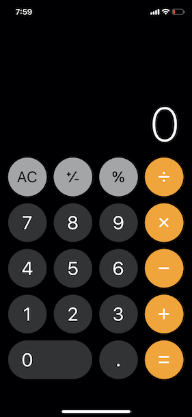

## Creating the UI for a Calculator using SwiftUI


Create your own version of Apple's Calculator App. In the end, your UI will look similar to this:



## Step 1️⃣ - Create a new Project

- Select SwiftUI for the interface.
- Save it in your preferred location.

## Step 2️⃣ - Adding Buttons

Make use of HStacks and VStacks to add all the buttons needed. Here's an example of how create one:

```swift
Button(action: {
  print("Button pressed")
}, label: {
    Text("AC").frame(width: 80, height: 80, alignment: .center)
      .background(Color.blue)
    .foregroundColor(.white)
    .cornerRadius(40)
    .font(.title)
})
```

If you get in trouble here, ask for help 😀

## Step 3️⃣- Adding the text field

Now that you have all the buttons, let's add the text field at the top where you can see the results of a calculation.

Add a Text at the top of the buttons and add the following modifiers:

```swift
Text("0").font(.system(size: 80))
  .frame(minWidth: 0, maxWidth: .infinity, minHeight: 0, maxHeight: .infinity, alignment: .bottomTrailing)
  .padding(.trailing, 30)
```

💡CMD+Click on `.bottomTrailing` and check the documentation to see all the available options for alignment.

The padding is similar, it will add some space to a specific edge of an element.

## Step 4️⃣ - Space Adjustments

We should adjust the bottom of the calculator and give it some space.

Add the following modifier to the entire main Stack.

```swift
.frame(minWidth: 0, maxWidth: .infinity, minHeight: 0, maxHeight: .infinity, alignment: .bottom).padding(.bottom,15)
```

## Step 5️⃣ - Displaying a total

We are not doing the logic behind the calculator, but it's a good idea to start seeing how you can include programming logic with Swift.

We've added a static text to the text field. In reality it will be changing as we make calculations to display the total.

Add a variable named `total` of type **Double** and assign it a value of **0**. It should go right below this line:

```swift
struct ContentView: View {

```
Change the text's static value to use the variable:

```swift
Text("\(total")
```
See what changes. You might be looking at too many zeros. 😅

We can get rid of them using a handy extension on the type Double. Add this code snippet taken from [this source](https://stackoverflow.com/questions/29560743/swift-remove-trailing-zeros-from-double) at the end of the file.

```swift
extension Double {
    func removeZerosFromEnd() -> String {
        let formatter = NumberFormatter()
        let number = NSNumber(value: self)
        formatter.minimumFractionDigits = 0
        formatter.maximumFractionDigits = 16 //maximum digits in Double after dot (maximum precision)
        return String(formatter.string(from: number) ?? "")
    }
}
```
It returns the number as a String, we might not use it in a final version of the calculator, but it's useful at the moment.

Here's how you would use it:

```swift
Text(total.removeZerosFromEnd())
```

🎉 At this point it should look a lot like the original app. If you are done come back to the main room.
